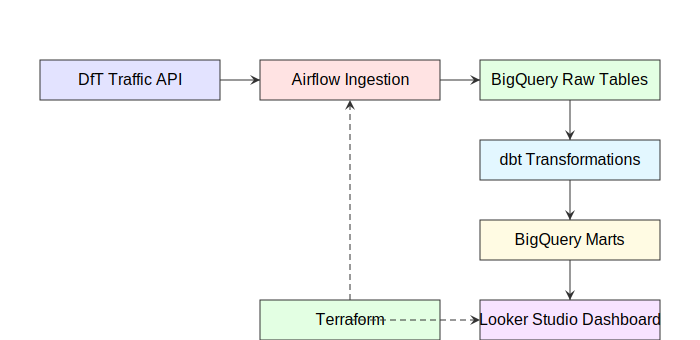

# London Borough Traffic Analytics

[](https://github.com/seunoye/London-Network-Analysis/actions/workflows/ci.yml)
[](LICENSE)

An end-to-end batch data pipeline analysing London's traffic flows by borough. Built as a capstone project for the [Data Engineering Zoomcamp](https://github.com/DataTalksClub/data-engineering-zoomcamp).

This project ingests DfT (Department for Transport) traffic count data, transforms it in BigQuery, and surfaces an interactive Looker Studio dashboard answering:

1. **Where are London's busiest boroughs?** — Total traffic volume rankings
2. **What types of vehicles dominate London's traffic?** — Composition breakdown (cars, commercial, buses, cycles)
3. **Which boroughs are most cycle-friendly?** — Cycle share percentage by borough

---

## Table of Contents

- [Architecture](#architecture)
- [Tech Stack](#tech-stack)
- [Project Structure](#project-structure)
- [Data Sources](#data-sources)
- [DAG](#dag)
- [dbt Models](#dbt-models)
- [Dashboard](#dashboard)
- [Data Limitations](#data-limitations)
- [Prerequisites](#prerequisites)
- [Setup](#setup)
- [Make Targets](#make-targets)
- [Dashboard Usage](#dashboard-usage)
- [Teardown](#teardown)
- [Environment Variables](#environment-variables)
- [Reproducibility](#reproducibility)
- [Testing](#testing)
- [CI/CD](#cicd)
- [Future Enhancements](#future-enhancements)
- [Contributing](#contributing)
- [License](#license)
- [Contact & Support](#contact--support)
- [Acknowledgments](#acknowledgments)

---

## Architecture



DfT Traffic API → Airflow Ingestion → BigQuery Raw Tables → dbt Transformations → BigQuery Marts → Looker Studio Dashboard

Infrastructure provisioned by Terraform (GCS bucket + BigQuery dataset)

**Pipeline type:** Batch — triggered manually or on a schedule via Airflow.

## Tech Stack

| Layer                | Technology                            |
| -------------------- | ------------------------------------- |
| Infrastructure (IaC) | Terraform + GCP                       |
| Orchestration        | Apache Airflow 2.10.4 (LocalExecutor) |
| Data Warehouse       | Google BigQuery                       |
| Transformations      | dbt-core + dbt-bigquery               |
| Dashboard            | Looker Studio                         |
| Containerisation     | Docker + Docker Compose               |
| Language             | Python 3.12                           |

## Project Structure

```
├── terraform/                  # GCP infrastructure as code
│   ├── main.tf                 # GCS bucket + BigQuery dataset
│   └── variables.tf
├── pipeline/                   # Ingestion + Airflow
│   ├── docker-compose.yaml     # Airflow webserver, scheduler, triggerer, Postgres
│   ├── Dockerfile              # Custom Airflow image
│   ├── Makefile                # Convenience commands
│   ├── ingest_dft_traffic.py   # DfT AADF API → BigQuery
│   └── dags/
│       └── london_pipeline.py  # Airflow DAG: ingest → dbt
├── dbt/
│   ├── dbt_project.yml
│   ├── profiles.yml
│   └── models/
│       ├── staging/            # Views: parse data, cast types, deduplicate
│       │   ├── sources.yml
│       │   ├── stg_traffic_counts.sql
│       │   └── ...
│       └── marts/              # Tables for dashboard
│           └── mart_borough_traffic.sql
├── docs/
│   ├── dashboard.md            # Dashboard user guide
│   └── dashboard.png           # Screenshot
└── pyproject.toml
```

## Data Sources

| Source                                              | Dataset                                         | API Key |
| --------------------------------------------------- | ----------------------------------------------- | ------- |
| [DfT Road Traffic](https://roadtraffic.dft.gov.uk/) | Average Annual Daily Flow (AADF) traffic counts | No      |

**Data Scope:**

- **Geographic:** 32 London boroughs + City of London (33 total)
- **Temporal:** 2023 annual aggregates
- **Content:** Vehicle counts by type (cars, LGVs, HGVs, motorcycles, cycles, buses)
- **Monitoring:** ~500 traffic counting locations (AADF points)

## DAG

```
ingest_dft_traffic ──► dbt_run ──► Looker Studio
```

The DfT traffic ingest task fetches AADF data from the public API and loads directly to BigQuery. The `dbt_run` task then builds staging views and the `mart_borough_traffic` table used by the dashboard.

## dbt Models

### Staging (Views)

| Model                | Source           | Description                                                                                         |
| -------------------- | ---------------- | --------------------------------------------------------------------------------------------------- |
| `stg_traffic_counts` | `traffic_counts` | Deduplicates on `count_point_id + year`, casts vehicle count columns to integers, parses geometries |

### Marts (Tables for Dashboard)

| Model                  | Partition | Cluster   | Description                                                                                                                        |
| ---------------------- | --------- | --------- | ---------------------------------------------------------------------------------------------------------------------------------- |
| `mart_borough_traffic` | —         | `borough` | Annual traffic by borough: motor vehicles, pedal cycles, buses, LGVs, HGVs, motorcycles, cycle share %, average vehicles per point |

**Lineage:**

```
sources (traffic_counts)
  └──► stg_traffic_counts
         └──► mart_borough_traffic (Dashboard data source)
```

## Dashboard

**Name:** London Borough Traffic Summary, 2023

**Data Source:** `mart_borough_traffic` (BigQuery)

**Platform:** Looker Studio (Interactive web dashboard)

### Dashboard Components

| Component                  | Type               | Description                                                                                                                                            |
| -------------------------- | ------------------ | ------------------------------------------------------------------------------------------------------------------------------------------------------ |
| **KPI Cards**              | Metric cards (5)   | Motor Vehicles (6.19M), Pedal Cycles (126.65K), Buses & Coaches (123.45K), Monitoring Points (13), Cycle Share % (1.97%)                               |
| **Total Traffic Chart**    | Vertical bar chart | Top 10 boroughs by total vehicle count; sorted descending; Waltham Forest leads with 297.8K vehicles                                                   |
| **Traffic Composition**    | Pie chart          | All 6 vehicle types breakdown: Cars (82.4%), LGVs (12%), HGVs (3.8%), Motorcycles (1.1%), Pedal Cycles (1.9%), Buses & Coaches (1.9%)                  |
| **Borough Rankings Table** | Interactive table  | All 32 boroughs with 6 metrics: Motor Vehicles, Pedal Cycles, Buses & Coaches, Average Vehicles per Point, Cycle Share %; sortable columns; pagination |
| **Borough Filter**         | Dropdown selector  | Users can filter all dashboard elements (KPIs, charts, table) by specific borough or view all 32 boroughs                                              |

### Dashboard Features

- ✅ **Interactive filtering** — Borough selector updates all KPIs, charts, and table in real-time
- ✅ **Comprehensive metrics** — 5 KPI cards showing London-wide summary for 2023
- ✅ **Multi-perspective views** — Borough rankings (bar chart), traffic composition (pie), detailed table
- ✅ **Professional design** — Dark theme, responsive layout, readable fonts, balanced spacing
- ✅ **Mobile responsive** — Works on desktop, tablet, and mobile devices
- ✅ **Data attribution** — Footer shows data source, scope, and last update timestamp
- ✅ **Sortable table** — Click column headers to sort ascending/descending

### Dashboard Questions Answered

| Question                                  | Answered | How                                                                        |
| ----------------------------------------- | -------- | -------------------------------------------------------------------------- |
| "Where are London's busiest boroughs?"    | ✅ Yes   | Bar chart + table show Waltham Forest, Bexley, Hammersmith as top 3        |
| "What vehicle types are most common?"     | ✅ Yes   | Pie chart shows cars dominate (82%), followed by commercial vehicles (16%) |
| "Which boroughs have highest cycling?"    | ✅ Yes   | Cycle Share % column shows Brent, Waltham Forest, Hounslow lead (2-2.5%)   |
| "Which boroughs have most buses?"         | ✅ Yes   | Buses & Coaches column in table shows rankings                             |
| "How many monitoring points per borough?" | ✅ Yes   | Average/Point column shows traffic monitoring density                      |
| Where are London's busiest road types?    | ❌ No    | Road type data not available in the current dataset                            |
| How has traffic changed over time?        | ❌ No    | Only 2023 data available; historical comparison requires 2024+ data        |


## Data Limitations

**Current Dataset:**

- ✅ Geographic scope: 33 London boroughs
- ✅ Time scope: 2023 annual aggregates
- ✅ Vehicle types: 6 categories (cars, LGVs, HGVs, motorcycles, cycles, buses)
- ✅ Metrics: Total counts, averages, percentages
- ✅ Monitoring coverage: ~500 counting locations across London

**To answer road-type or historical trend questions, additional data integration would be required.**

## Prerequisites

- **Docker** and **Docker Compose**
- **Terraform** >= 1.7
- A **GCP project** with BigQuery API and Cloud Storage API enabled
- A **GCP service account key** (JSON) with `BigQuery Admin` and `Storage Admin` roles

## Setup

### 1. Clone the repository

```bash
git clone https://github.com/seunoye/London-Network-Analysis.git
cd London-Network-Analysis
```

### 2. Add GCP credentials

Place your service account key at:

```
terraform/keys/la_creds.json
```

This path is gitignored. **Never commit credentials.**

### 3. Provision GCP infrastructure

```bash
cd pipeline
make infra
```

Creates:

- **GCS bucket** `london-analytics-bucket`
- **BigQuery dataset** `london_analytics_dataset`

### 4. Configure environment

Create `pipeline/.env`:

```env
GCP_PROJECT_ID=london-analytics
BQ_DATASET=london_analytics_dataset
DFT_YEAR=2023
AIRFLOW_UID=50000
```

### 5. Start Airflow

```bash
cd pipeline
make up
```

| Service    | URL / Port            | Credentials         |
| ---------- | --------------------- | ------------------- |
| Airflow UI | http://localhost:8080 | `airflow / airflow` |

In GitHub Codespaces: open the **Ports** tab and forward port 8080.

### 6. Trigger the pipeline

```bash
make trigger-dag
```

Or open the Airflow UI, find `london_pipeline`, and click **Trigger DAG**.

### 7. Run dbt transformations

dbt runs automatically as the final DAG task. To run manually:

```bash
make dbt-run    # build all models
make dbt-test   # run data quality tests
```

### 8. Connect to Looker Studio

1. Open [Looker Studio](https://lookerstudio.google.com)
2. Create a new report
3. Connect to BigQuery data source: `london_analytics_dataset.mart_borough_traffic`
4. Build charts and tables using the dashboard layout provided in `docs/dashboard.md`

## Make Targets

Run from `pipeline/`:

| Command            | Description                                   |
| ------------------ | --------------------------------------------- |
| `make help`        | Show all available targets                    |
| `make infra`       | Provision GCP resources with Terraform        |
| `make up`          | Build images and start all containers         |
| `make down`        | Stop all containers                           |
| `make restart`     | Stop then start containers                    |
| `make trigger-dag` | Trigger the Airflow DAG                       |
| `make dbt-run`     | Run dbt models inside the scheduler container |
| `make dbt-test`    | Run dbt tests inside the scheduler container  |
| `make dbt-docs`    | Generate and serve dbt docs on port 8081      |
| `make status`      | Show container health                         |
| `make logs`        | Tail Airflow scheduler logs                   |
| `make clean`       | Remove containers, volumes, and build cache   |

## Dashboard Usage


https://lookerstudio.google.com/reporting/f696d71e-cc63-4750-af9e-6714b4947308


### Filtering by Borough

1. Click the **Borough** dropdown filter at the top right of the dashboard
2. Select a specific borough (e.g., "Waltham Forest")
3. All KPI cards, charts, and table data update automatically

**Example:** Select "Bexley" to see:

- Motor Vehicles: 283.86K (instead of 6.19M)
- Pedal Cycles: 4.66K (instead of 126.65K)
- All other metrics filtered to Bexley only

### Interpreting Dashboard Metrics

**Motor Vehicles:** Total annual count of all motorised vehicles (cars, vans, buses, HGVs, etc.)

**Pedal Cycles:** Total annual count of bicycles

**Buses & Coaches:** Total annual count of public transport vehicles

**Monitoring Points:** Number of AADF counting locations in the selected area (shows data collection coverage)

**Cycle Share %:** Percentage of total traffic that is bicycles (indicator of cycling adoption)

**Average/Point:** Average number of vehicles per monitoring location (shows traffic intensity; higher = busier monitoring point)

### Sorting the Table

Click any column header to sort ascending or descending. Default sort is by Motor Vehicles (highest first).

### Interpreting the Pie Chart

The pie chart shows what fraction of London's 6.4M+ annual vehicle counts come from each vehicle type:

- **Cars dominate** (82.4%) — private motor vehicles
- **Commercial vehicles** (LGVs + HGVs) make up 16% of traffic
- **Active modes** (cycles + buses) combined are only 3.8%

This suggests room for growth in sustainable transport modes.

## Teardown

```bash
cd pipeline && make clean             # stop containers and remove volumes
cd ../terraform && terraform destroy  # destroy GCP resources
```

## Environment Variables

| Variable         | Default                    | Description               |
| ---------------- | -------------------------- | ------------------------- |
| `GCP_PROJECT_ID` | `london-analytics`         | GCP project ID            |
| `BQ_DATASET`     | `london_analytics_dataset` | BigQuery dataset name     |
| `DFT_YEAR`       | `2023`                     | Year of DfT traffic data  |
| `AIRFLOW_UID`    | `50000`                    | UID for Airflow container |

## Reproducibility

The pipeline is fully reproducible:

- **DfT Traffic API** — No API key required; public endpoint is paginated and auto-retried
- **Infrastructure** — Fully codified in Terraform; `make infra` provisions all GCP resources
- **Docker images** — Pinned versions (Airflow 2.10.4-python3.12)
- **Data transformations** — Deterministic dbt models with no external dependencies

## Testing

### Unit Tests

Unit tests for Python ingestion scripts are located in the `tests/` directory:

```bash
pytest tests/
```

### dbt Tests

Run dbt's built-in data quality tests:

```bash
cd pipeline
make dbt-test
```

### Airflow DAG Validation

Validate Airflow DAGs:

```bash
python -c "from airflow.models import DagBag; DagBag('pipeline/dags')"
```

## CI/CD

Continuous Integration is set up using GitHub Actions. On every push or pull request to `main`, the following checks run automatically:

- Python unit tests (`pytest`)
- dbt build and tests
- Python linting (`flake8`)
- Airflow DAG validation

See `.github/workflows/ci.yml` for details.

## Future Enhancements

### Comparison with 2024 data:

- Add year-over-year comparison (2023 vs 2024)
- Add trend analysis showing monthly progression
- Add growth rate metrics by borough
- Show seasonal patterns (which months have highest cycling?)
- Add predictive analysis for future traffic

### Add road-level data:

- Create separate "Road Network Analysis" dashboard
- Show road density by type (A-roads, B-roads, residential)
- Identify busiest individual roads
- Analyse congestion patterns by road classification
- Map traffic hotspots geographically

### Additional features:

- Borough filter refined to neighbourhood level
- Vehicle type filter (show only cars, only buses, etc.)
- Peak hour analysis (if hourly data available)
- Weather correlation analysis
- Public transport integration

## Contributing

Contributions are welcome! Please:

1. Fork the repository
2. Create a feature branch
3. Make your changes
4. Run tests: `pytest tests/ && make dbt-test`
5. Submit a pull request

## License

This project is open source under the MIT License.

## Contact & Support

For questions or issues:

- Open a GitHub issue
- Check existing issues and discussions
- Review the dbt documentation in `dbt/docs/`

## Acknowledgments

- [Data Engineering Zoomcamp](https://github.com/DataTalksClub/data-engineering-zoomcamp) — Project framework
- [DfT Road Traffic Data](https://roadtraffic.dft.gov.uk/) — Data source
- [Looker Studio](https://lookerstudio.google.com/) — Visualization platform
- GCP, BigQuery, dbt communities — Tools and support
